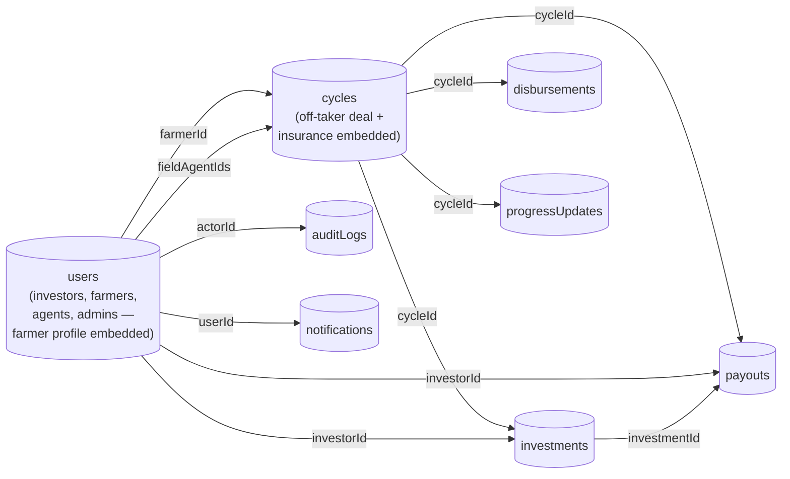

# AgriCapital Rwanda — MongoDB Database Design & Workflow

**Related issues:** #1 (Create the database design and workflow), #4 (Create ERD and doc everything)
**Status:** Draft v1.0 — MongoDB version
**Owner:** Backend Engineering
**Database:** MongoDB

---

## 1. How this document is organized

This explains how the AgriCapital platform's data will be stored in MongoDB. Instead of tables with strict rows and columns (like a traditional SQL database), MongoDB stores data as flexible JSON-like documents grouped into **collections**.

The main design decision in MongoDB is: **should related data live inside the same document (embedded), or in a separate collection linked by an ID (referenced)?**

The rule of thumb used throughout this doc:
- **Embed** when the data is small, always read together with its parent, and doesn't need to be queried on its own (e.g. a farmer's profile details live inside their user record).
- **Reference** when the data grows over time, is queried independently, or is shared/linked across multiple records (e.g. one cycle can have many investments, so investments live in their own collection).

---

## 2. Collections Overview

| Collection | Purpose | Grows over time? |
|---|---|---|
| `users` | Everyone with a login: investors, farmers, field agents, admins. Farmer-specific details are embedded here. | Slowly |
| `offTakerAgreements` | Buyer contracts, embedded directly inside each cycle (not its own collection — see §3.3) | — |
| `cycles` | The central record — one funding round for a farmer's crop/livestock batch | Slowly (10 pilot cycles at MVP) |
| `investments` | Each investor's contribution to a cycle | Fast |
| `disbursements` | Each tranche of money released to a farmer | Fast |
| `progressUpdates` | Field agent visit logs (with photos) | Fast |
| `payouts` | Final investor returns per cycle | Fast |
| `auditLogs` | A record of every important financial action, for compliance | Very fast |
| `notifications` | Emails/SMS sent to users | Fast |

---

## 3. Collection Details

### 3.1 `users`

One document per person (Investor, Farmer, Field Agent, Admin/Ops). If the person is a **Farmer**, their farm details are embedded directly in the same document — no separate collection needed, since a farmer's profile is always read together with their user info and never queried on its own.

```json
{
  "_id": "ObjectId",
  "role": "investor",              // "investor" | "farmer" | "field_agent" | "admin"
  "fullName": "Alice Mukamana",
  "email": "alice@example.com",
  "phone": "+250788000001",
  "passwordHash": "...",
  "kycStatus": "verified",         // "not_required" | "pending" | "verified" | "rejected"
  "idDocumentNumber": "1198012345678901",
  "paymentDetails": {
    "momoNumber": "+250788000001",
    "bankAccount": null
  },

  // Only present if role = "farmer"
  "farmerProfile": {
    "location": "Musanze District",
    "farmType": "livestock",       // "crop" | "livestock"
    "cooperativeName": "Musanze Dairy Cooperative"
  },

  "isActive": true,
  "createdAt": "ISODate",
  "updatedAt": "ISODate"
}
```

**Why embedded:** A farmer's profile is only ever looked at alongside their user account — there's no case in the app where you'd search "all farm locations" without also needing the farmer's name/contact. Embedding avoids an extra lookup on every screen that shows a farmer.

**Note:** Off-takers (hotels, schools, factories) do **not** get a `users` document in MVP — they don't log in. Their details are recorded inside the cycle they're linked to (see §3.3).

---

### 3.2 `cycles`

The heart of the platform — one funding round. The buyer contract (**off-taker agreement**) and **insurance status** are embedded directly inside the cycle, because each cycle has exactly one of each, and they're always displayed together with the cycle (on the investor's cycle detail page, for example).

```json
{
  "_id": "ObjectId",
  "farmerId": "ObjectId (→ users)",
  "fieldAgentIds": ["ObjectId (→ users)"],   // one or more agents assigned to this cycle
  "type": "livestock",                        // "crop" | "livestock"
  "purpose": "feeds",                          // "feeds" | "vaccines" | "seeds" | "fertilizer" | "other"
  "targetAmount": 2000000.00,
  "fundedAmount": 2000000.00,                  // kept in sync as investments are confirmed
  "finalSaleAmount": null,                     // set when the cycle completes
  "status": "in_progress",                     // see workflow in §4
  "location": "Musanze District",
  "expectedStartDate": "2026-11-01",
  "expectedEndDate": "2027-02-01",

  // Embedded: one buyer contract per cycle
  "offTakerAgreement": {
    "buyerName": "Kigali Serena Hotel",
    "buyerType": "hotel",                      // "hotel" | "school" | "factory" | "exporter" | "supermarket" | "other"
    "product": "Fresh milk",
    "pricePerUnit": 400.00,
    "quantity": 5000,
    "contractReference": "AGR-OT-2026-014",
    "contractDocumentUrl": null
  },

  // Embedded: insurance status + any incidents for this cycle
  "insurance": {
    "naisCovered": true,
    "policyReference": "NAIS-2026-0088",
    "insurerName": "SORAS Insurance",
    "coverageStartDate": "2026-11-01",
    "coverageEndDate": "2027-02-01",
    "claims": [
      // grows slowly — only added when something goes wrong
      {
        "incidentType": "disease",             // "disease" | "weather" | "other"
        "description": "Suspected mastitis in 2 cows",
        "reportedBy": "ObjectId (→ users)",
        "claimStatus": "filed",                // "reported" | "filed" | "approved" | "rejected" | "paid"
        "reportedAt": "ISODate",
        "resolvedAt": null
      }
    ]
  },

  "createdAt": "ISODate",
  "approvedAt": "ISODate",
  "completedAt": null
}
```

**Why embedded:** The off-taker agreement and insurance record are never shared between cycles and never queried without their parent cycle — you always ask "what's the buyer deal for *this* cycle," never "show me all off-taker agreements across every cycle" as a standalone list. Embedding keeps a cycle's full detail page to a single read.

**Why `insurance.claims` is a small embedded array, not its own collection:** in practice a cycle will have zero or very few incidents (a handful at most). If this ever needed to scale to hundreds of claims per cycle, it should move to its own collection — flagged as a future consideration, not an MVP concern.

---

### 3.3 `investments`

Kept as its **own collection** (not embedded in `cycles`) because: a cycle can have many investors, an investor needs to see all *their* investments across many cycles, and this data changes independently and often (pending → confirmed).

```json
{
  "_id": "ObjectId",
  "investorId": "ObjectId (→ users)",
  "cycleId": "ObjectId (→ cycles)",
  "amount": 500000.00,
  "paymentMethod": "momo",              // "momo" | "airtel_money" | "bank_transfer"
  "transactionReference": "MOMO-TX-88213",
  "status": "confirmed",                // "pending" | "confirmed" | "failed" | "refunded"
  "createdAt": "ISODate",
  "confirmedAt": "ISODate"
}
```

---

### 3.4 `disbursements`

Own collection — tranches released to a farmer over the life of a cycle. Kept separate so admins can query/report on all disbursements across every cycle easily (e.g. "how much has gone out this month").

```json
{
  "_id": "ObjectId",
  "cycleId": "ObjectId (→ cycles)",
  "amount": 600000.00,
  "purpose": "Dairy feed purchase — batch 1",
  "method": "momo",
  "transactionReference": "MOMO-TX-90112",
  "approvedBy": "ObjectId (→ users, admin)",
  "status": "completed",                // "pending" | "completed" | "failed"
  "disbursedAt": "ISODate",
  "createdAt": "ISODate"
}
```

---

### 3.5 `progressUpdates`

Own collection — a growing timeline of field agent visits. Photos are embedded as a simple array of URLs since they're always small in number and only ever read together with the update they belong to.

```json
{
  "_id": "ObjectId",
  "cycleId": "ObjectId (→ cycles)",
  "fieldAgentId": "ObjectId (→ users)",
  "updateType": "health_check",   // "health_check" | "growth_stage" | "vaccination" | "harvest" | "incident"
  "notes": "Cows appear healthy, vaccinations on schedule.",
  "photoUrls": [
    "https://.../photo1.jpg",
    "https://.../photo2.jpg"
  ],
  "visitDate": "2026-11-15",
  "createdAt": "ISODate"
}
```

---

### 3.6 `payouts`

Own collection — one document per investor, per cycle, created at cycle completion.

```json
{
  "_id": "ObjectId",
  "cycleId": "ObjectId (→ cycles)",
  "investorId": "ObjectId (→ users)",
  "investmentId": "ObjectId (→ investments)",
  "grossReturnAmount": 575000.00,
  "platformFeeAmount": 71875.00,     // 10–15% of gross
  "brokerageFeeAmount": 20125.00,    // 3–5% of gross
  "netPayoutAmount": 483000.00,      // gross - platformFee - brokerageFee
  "status": "pending",               // "pending" | "processed" | "failed"
  "transactionReference": null,
  "processedAt": null,
  "createdAt": "ISODate"
}
```

---

### 3.7 `auditLogs`

Own collection — a permanent, append-only record of every important action. This is what satisfies the platform's auditability requirement and Rwanda's Data Protection Law access-logging obligation. **Nothing is ever edited or deleted from this collection.**

```json
{
  "_id": "ObjectId",
  "actorId": "ObjectId (→ users, nullable for system actions)",
  "action": "investment.confirmed",
  "entityType": "investment",
  "entityId": "ObjectId",
  "oldValue": { "status": "pending" },
  "newValue": { "status": "confirmed" },
  "createdAt": "ISODate"
}
```

---

### 3.8 `notifications`

```json
{
  "_id": "ObjectId",
  "userId": "ObjectId (→ users)",
  "type": "investment_confirmed",   // "investment_confirmed" | "disbursement_made" | "progress_update" | "cycle_completed"
  "channel": "sms",                  // "email" | "sms"
  "content": "Your investment of 500,000 RWF has been confirmed.",
  "status": "sent",                  // "pending" | "sent" | "failed"
  "createdAt": "ISODate"
}
```

---

## 4. How Collections Relate to Each Other



Solid arrows = a reference (an ID stored in one document pointing to another). There are no arrows *into* `cycles` for off-taker agreements or insurance, because those are embedded, not referenced.

---

## 5. Cycle Status Workflow

This doesn't change based on which database is used — it's a business rule enforced in the application code.

```
draft → under_review → approved → funding → funded → in_progress → completed → closed
                ↓            ↓         ↓
            cancelled    cancelled  cancelled/failed
```

| Status | What triggers it | Who | Rule to enter this status |
|---|---|---|---|
| `draft` | Field agent starts filling out a cycle | Field Agent | None |
| `under_review` | Field agent submits it | Field Agent | Farmer, type, purpose, target amount, and location are all filled in |
| `approved` | Admin reviews and approves | Admin | The embedded `offTakerAgreement` must be filled in |
| `funding` | Cycle is published for investors to see | Admin (or automatic) | Status was `approved` |
| `funded` | Enough investors have committed money | System (automatic) | `fundedAmount` reaches `targetAmount` |
| `in_progress` | First disbursement goes out | System (automatic) | Status was `funded` |
| `completed` | Admin records the harvest sale | Admin | `finalSaleAmount` is filled in |
| `closed` | All investor payouts are done | System (automatic) | Every payout for this cycle has `status: "processed"` |
| `cancelled` | Cycle is abandoned | Admin | Any investments already made must be refunded |

---

## 6. Validation Rules

MongoDB doesn't enforce relationships or business rules the way SQL does, so these need to be checked in the application code (and backed up with MongoDB's built-in **schema validation**, see §7):

1. An investment that would push `fundedAmount` above `targetAmount` should be rejected or capped.
2. An investor can't have their investment marked `confirmed` unless their `kycStatus` is `verified`.
3. A cycle can't move to `approved` unless its embedded `offTakerAgreement` is filled in.
4. The total of all `completed` disbursements for a cycle can never be more than that cycle's `fundedAmount`.
5. Disbursements can only be created while a cycle's status is `funded` or `in_progress`.
6. Progress updates can only be logged while a cycle's status is `funded` or `in_progress`.
7. `netPayoutAmount` must always equal `grossReturnAmount - platformFeeAmount - brokerageFeeAmount`.
8. A cycle can't move to `closed` until every payout tied to it is `processed`.
9. `auditLogs` documents are never updated or deleted, only inserted.

---

## 7. MongoDB Schema Validation (example)

MongoDB lets you enforce basic rules at the database level using JSON Schema validation on a collection. Here's an example for `cycles` — the same pattern applies to the other collections:

```javascript
db.createCollection("cycles", {
  validator: {
    $jsonSchema: {
      bsonType: "object",
      required: ["farmerId", "type", "purpose", "targetAmount", "status", "location"],
      properties: {
        type: { enum: ["crop", "livestock"] },
        purpose: { enum: ["feeds", "vaccines", "seeds", "fertilizer", "other"] },
        targetAmount: { bsonType: "number", minimum: 0 },
        fundedAmount: { bsonType: "number", minimum: 0 },
        status: {
          enum: ["draft", "under_review", "approved", "funding", "funded",
                 "in_progress", "completed", "closed", "cancelled"]
        }
      }
    }
  }
});
```

---

## 8. Recommended Indexes

Indexes matter more in MongoDB since there's no automatic foreign-key indexing like in SQL. These are the ones worth creating from day one:

| Collection | Index | Why |
|---|---|---|
| `users` | `email` (unique), `phone` (unique) | Login lookups, prevent duplicate accounts |
| `cycles` | `status` | The investor "browse cycles" screen filters by status constantly |
| `cycles` | `farmerId` | Look up all cycles for a given farmer |
| `investments` | `cycleId` | Calculate `fundedAmount`, list all investors for a cycle |
| `investments` | `investorId` | "My Investments" dashboard |
| `disbursements` | `cycleId` | Sum disbursements for a cycle |
| `progressUpdates` | `cycleId`, sorted by `visitDate` | Timeline view |
| `payouts` | `cycleId`, `investorId` | Payout history lookups |
| `auditLogs` | `entityType` + `entityId` | Compliance lookups: "show me the history of this record" |

---

## 9. Edge Cases & Open Questions (same as SQL version — still apply)

- **Stale unfunded cycles:** what happens if a cycle never reaches its funding target? Needs a decision — likely a `fundingDeadline` field plus a scheduled job.
- **Refund flow:** the `investments.status = "refunded"` value exists, but the actual refund process (who triggers it, how money moves back) needs to be scoped before cancellations are supported.
- **Insurance not confirmed at approval time:** should cycle approval be blocked without confirmed NAIS coverage, or just flagged? Needs product sign-off — recommend not hard-blocking approval, but flagging clearly on the investor-facing cycle page.
- **Off-taker logins:** if off-takers ever need their own accounts later, `offTakerAgreement` is currently embedded with no `userId` — this would need a small migration to pull it into its own collection at that point.
- **Fee percentages:** platform fee (10–15%) and brokerage fee (3–5%) should live in a small `config` collection rather than being hardcoded, since rates may change between pilots and Year 2.

---

## 10. Why MongoDB Fits This Project

Worth stating explicitly for reviewers: MongoDB is a reasonable fit here because most of AgriCapital's data naturally clusters around one "hub" document — the **cycle** — with its buyer deal, insurance status, and incident history read together as a single unit almost every time the app touches a cycle. The fast-growing, independently-queried data (investments, disbursements, progress updates, payouts, audit logs) is kept in separate collections so it can scale and be indexed on its own. This mirrors how the investor and admin dashboards will actually query the data.